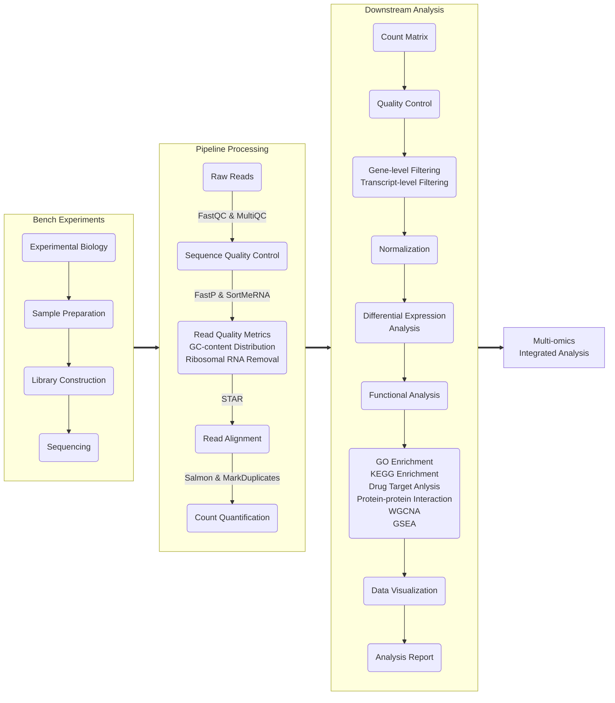

# RNA-seq
## RNA-seq Experimental Design Best Practice
- **Sample Preparation**:
  * Highly recommend snap-frozen cell pellets
- **Library Construction**:
  * mRNA library construction for coding mRNA studies
  * Total RNA library construction for long noncoding RNA studies
- **Data Type**:
  * Paired-end 150bp
  * Short-read sequencing is most commonly used. Long-read sequencing is recommended for isoform-emphasized analysis
- **Replicates**:
    * Highly recommend >= 3 biological replicates for statistical analysis
    * Technical replicates are typically unnecessary for biology discovery projects
- **Sequencing Depth**:
    * At least 20M read pairs recommended for most cell line samples
    * At least 30M read pairs recommended for patient samples and long noncoding RNA studies
- **Batch Effects**:
    * Ideally, samples in the same studies are sequenced together. If samples need to sequenced in batches, ensure that samples are randomized and replicates are eveny distributed across batches
- **Platform**:
    * Illumina NovaSeq 6000

## RNA-seq Experimental and Analysis Workflow

> Note: This is a standard workflow designed for bulk mRNA sequencing. Based on the specific biological questions, modifications might be called to this workflow.

- **Reference Genome**:
    * Gencode v32 reference genome
    * Command line download: <code>wget https://cf.10xgenomics.com/supp/cell-exp/refdata-gex-GRCh38-2020-A.tar.gz</code>
    * Direct download: [Human reference (GRCh38) dataset required for Cell Ranger](https://support.10xgenomics.com/single-cell-gene-expression/software/downloads/latest/)
- **Differential Expression Analysis package**:
    * Significance Cutoff: abs|FC| >= 1.5, fdr < 0.05
    * DESeq2: Prioritized method.
    * edgeR: Secondary method (especially when biological replicates are lacking in experiments).

## RNA-seq Computational Analysis
- <code>01_nextflow_RNAseq</code> General command lines used to process raw reads using nf-core pipelines.
- <code>02_gene_filtering</code> Additional gene-level filtering criteria (stringent).
- <code>03_DESeq2</code> Downstream differential expression analysis (DEA) using DESeq2.
- <code>04_edgeR</code> Downstream DEA using edgeR.
- <code>05_enrichment</code> Enrichment analysis on significant differentially expressed genes (DEGs).
- <code>06_visualization</code> Data visualization of RNA-seq analysis results: volcano plots, venn diagram, chow ruskey plot, heatmap, etc.
- <code>07_cell_type_specific</code> Identification and exploration of cell-type specific signature genes.

## Tools 
- R-4.3.2
- nextflow 3.12.0
- FastQC 0.11.9
- MultiQC 1.14
- FastP 0.23.4
- SortMeRNA 4.3.4
- STAR 2.6.1
- Salmon 1.10.1
- MarkDuplicates 3.0.0
- DESeq2 v1.42.0

